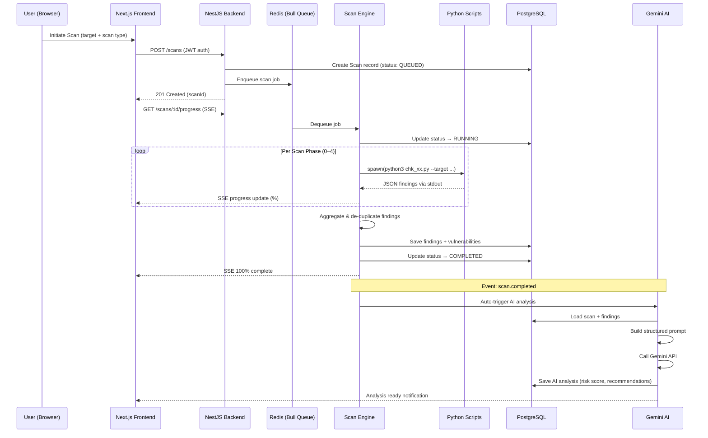
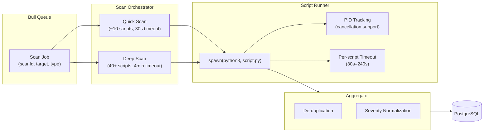
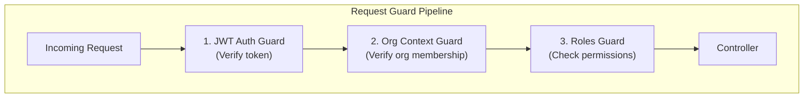

# VaultScan — High-Level Architecture

## System Overview

VaultScan is an AI-powered vulnerability scanner built as a full-stack application with a **Next.js** frontend, a **NestJS** backend, **PostgreSQL** for persistence, **Redis** for job queuing, **Python** scripts as the scanning engine, and **Google Gemini** for AI-powered analysis.

---

## Architecture Diagram

```mermaid
graph TB
    subgraph CLIENT["🖥️ Client Layer"]
        Browser["Browser"]
    end

    subgraph FRONTEND["⚛️ Frontend — Next.js (Port 3000)"]
        direction TB
        AppRouter["App Router<br/>(Auth + Dashboard layouts)"]
        
        subgraph FE_FEATURES["Feature Modules"]
            FE_Auth["Authentication"]
            FE_Dashboard["Dashboard / Overview"]
            FE_Scans["Scans"]
            FE_Findings["Findings"]
            FE_AI["AI Analysis & Chat"]
            FE_Reports["Reports"]
            FE_Assets["Assets"]
            FE_Schedules["Schedules"]
            FE_Notifications["Notifications"]
            FE_Settings["Settings"]
        end

        FE_Services["Services Layer<br/>(API Client, Auth Interceptor)"]
        FE_Middleware["Middleware<br/>(Route Protection)"]
    end

    subgraph BACKEND["🔧 Backend — NestJS (Port 3001)"]
        direction TB
        
        subgraph GUARDS["Global Guards"]
            JWTGuard["JWT Auth Guard"]
            OrgGuard["Org Context Guard"]
            RolesGuard["Roles Guard"]
        end
        
        subgraph API_MODULES["API Modules (Controllers + Services)"]
            AuthMod["Auth Module<br/>(JWT + Refresh Tokens)"]
            UsersMod["Users Module"]
            OrgsMod["Organizations Module"]
            AssetsMod["Assets Module"]
            ScansMod["Scans Module"]
            FindingsMod["Findings Module"]
            DashMod["Dashboard Module"]
            ReportsMod["Reports Module<br/>(PDF Generator)"]
            NotifMod["Notifications Module"]
            SchedMod["Schedules Module"]
        end
        
        subgraph SCAN_ENGINE["🔍 Scan Engine"]
            ScanProcessor["Scan Processor<br/>(Bull Queue Consumer)"]
            Orchestrator["Scan Orchestrator<br/>(Phase-based execution)"]
            ScriptRunner["Script Runner<br/>(Python subprocess spawner)"]
            Aggregator["Aggregator Service<br/>(De-duplication)"]
            ProgressStore["Progress Store<br/>(In-memory SSE state)"]
        end
        
        subgraph AI_MODULE["🤖 AI Analysis Module"]
            AIAnalysis["AI Analysis Service<br/>(Auto-triggered on scan.completed)"]
            AIChat["AI Chat Service<br/>(Interactive Q&A)"]
            AIInsights["AI Insights Service<br/>(Trend analysis)"]
            PromptBuilder["Prompt Builder"]
        end
        
        EventBus["Event Emitter<br/>(scan.completed → AI trigger)"]
    end

    subgraph SCRIPTS["🐍 Python Scan Scripts"]
        direction TB
        Phase0["Phase 0: Auth Discovery<br/>chk_00_auth_discovery.py"]
        Phase1["Phase 1: Infrastructure<br/>chk_quick.py, ssl_checker.py,<br/>chk_17_nmap.py, service_fingerprint.py"]
        Phase1_5["Phase 1.5: DNS Recon<br/>chk_09_subdomain.py, chk_10_dns.py"]
        Phase2a["Phase 2a: Injection Testing<br/>chk_01_sql.py, chk_02_xss.py,<br/>chk_06_cmdi.py, chk_12_ssti.py,<br/>chk_11_xxe.py"]
        Phase2b["Phase 2b: Access Control<br/>chk_03_csrf.py, chk_04_open_redirect.py,<br/>chk_05_lfi.py, chk_14_idor.py,<br/>chk_13_ssrf.py"]
        Phase2c["Phase 2c: Protocol & Headers<br/>chk_15–chk_42 (25+ checks)<br/>CORS, JWT, GraphQL, NoSQL,<br/>LDAP, Cache Poison, WAF..."]
        Phase3["Phase 3: Configuration<br/>chk_07_misconfig.py,<br/>chk_08_sensitive_data.py"]
    end

    subgraph INFRA["🏗️ Infrastructure (Docker Compose)"]
        Postgres[("PostgreSQL 15<br/>(Port 5434→5432)<br/>Database: vaultscan")]
        Redis[("Redis 7<br/>(Port 6380→6379)<br/>Job Queues")]
    end

    subgraph EXTERNAL["☁️ External Services"]
        Gemini["Google Gemini API<br/>(gemini-2.0-flash-exp)"]
        SMTP["SMTP Server<br/>(Email Notifications)"]
    end

    %% Client → Frontend
    Browser -->|"HTTPS"| AppRouter
    AppRouter --> FE_FEATURES
    FE_FEATURES --> FE_Services
    FE_Middleware -.->|"Route protection"| AppRouter

    %% Frontend → Backend
    FE_Services -->|"REST API + SSE<br/>(JWT Bearer Token)"| GUARDS

    %% Guards → Modules
    GUARDS --> API_MODULES
    GUARDS --> SCAN_ENGINE
    GUARDS --> AI_MODULE

    %% Scan flow
    ScansMod -->|"Enqueue job"| Redis
    Redis -->|"Dequeue"| ScanProcessor
    ScanProcessor --> Orchestrator
    Orchestrator --> ScriptRunner
    ScriptRunner -->|"spawn(python3)"| SCRIPTS
    SCRIPTS -->|"JSON stdout"| ScriptRunner
    ScriptRunner --> Aggregator
    Aggregator -->|"Save findings"| Postgres
    Orchestrator -->|"SSE progress"| ProgressStore
    ProgressStore -->|"Real-time updates"| FE_Services

    %% Event-driven AI
    Orchestrator -->|"scan.completed"| EventBus
    EventBus -->|"trigger"| AIAnalysis
    AIAnalysis --> PromptBuilder
    PromptBuilder -->|"structured prompt"| Gemini
    Gemini -->|"JSON analysis"| AIAnalysis
    AIAnalysis -->|"Save results"| Postgres
    AIChat -->|"Interactive queries"| Gemini
    AIInsights -->|"Trend data"| Gemini

    %% Data layer
    API_MODULES -->|"TypeORM"| Postgres
    AuthMod -->|"Session tokens"| Redis
    ReportsMod -->|"Generate PDF"| Postgres
    NotifMod -->|"Email alerts"| SMTP
    SchedMod -->|"Cron triggers"| ScansMod

    %% Styling
    classDef frontend fill:#1a1a2e,stroke:#e94560,color:#fff,stroke-width:2px
    classDef backend fill:#16213e,stroke:#0f3460,color:#fff,stroke-width:2px
    classDef infra fill:#0a0a23,stroke:#533483,color:#fff,stroke-width:2px
    classDef external fill:#1b1b2f,stroke:#e23e57,color:#fff,stroke-width:2px
    classDef scripts fill:#162447,stroke:#1f4068,color:#fff,stroke-width:2px

    class Browser,AppRouter,FE_FEATURES,FE_Services,FE_Middleware frontend
    class GUARDS,API_MODULES,SCAN_ENGINE,AI_MODULE,EventBus backend
    class Postgres,Redis infra
    class Gemini,SMTP external
    class SCRIPTS,Phase0,Phase1,Phase1_5,Phase2a,Phase2b,Phase2c,Phase3 scripts
```

---

## Data Flow: Scan Lifecycle

---

## Module Breakdown

### Frontend (Next.js / React)

| Module | Path | Purpose |
|--------|------|---------|
| **Authentication** | `Features/authentication` | Login, register, JWT management |
| **Dashboard** | `Features/dashboard` | Overview metrics, risk trends |
| **Scans** | `Features/scans` | Create/view/cancel scans, real-time progress |
| **Findings** | `Features/findings` | Vulnerability listings, severity badges |
| **AI Analysis** | `Features/ai` | AI remediation, chat, insights |
| **Reports** | `Features/reports` | PDF report generation/download |
| **Assets** | `Features/assets` | Target management (domains, IPs, URLs) |
| **Schedules** | `Features/schedule` | Recurring scan scheduling |
| **Notifications** | `Features/notifications` | Alert center |
| **Settings** | `Features/settings` | User & org settings |

---

### Backend (NestJS)

| Module | Key Services | Purpose |
|--------|-------------|---------|
| **Auth** | `AuthService`, JWT + Refresh strategies | User authentication with JWT guard pipeline |
| **Users** | `UsersService` | User CRUD |
| **Organizations** | `OrganizationsService` | Multi-tenant org management |
| **Assets** | `AssetsService` | Scan target registration (Domain, IP, URL) |
| **Scans** | `ScansService`, `ScanProgressController` | Scan CRUD + SSE real-time progress |
| **Scan Engine** | `ScanOrchestrator`, `ScriptRunner`, `Aggregator` | Phase-based scan execution via Bull queue |
| **Findings** | `FindingsService` | Vulnerability storage & querying |
| **AI Analysis** | `AiAnalysisService`, `AiChatService`, `AiInsightsService` | Gemini-powered analysis, chat, trend insights |
| **Reports** | `ReportsService`, `PdfGeneratorService` | PDF vulnerability reports |
| **Schedules** | `SchedulesService` | Cron-based recurring scans |
| **Notifications** | `NotificationsService` | In-app + email alerts |
| **Dashboard** | `DashboardService` | Aggregated metrics |

---

### Scan Engine Deep Dive

---

### Security Architecture

| Layer | Mechanism |
|-------|-----------|
| **Authentication** | JWT + Refresh Token (HttpOnly cookies) |
| **Authorization** | Role-based (RBAC) via decorators |
| **Multi-tenancy** | Organization context guard on every request |
| **Input Sanitization** | Script args sanitized (`;`, `&`, `|`, `` ` ``, `$` stripped) |
| **Process Isolation** | Python scripts run as child processes with PID tracking |

---

### Infrastructure

| Component | Technology | Purpose |
|-----------|-----------|---------|
| **Database** | PostgreSQL 15 | Persistent storage (TypeORM + migrations) |
| **Queue** | Redis 7 + Bull | Async scan job processing |
| **AI** | Google Gemini (2.0 Flash) | Vulnerability analysis, chat, insights |
| **Email** | SMTP (configurable) | Alert notifications |
| **Containerization** | Docker Compose | Full-stack orchestration |
| **Deployment** | Vercel (frontend) + Docker (backend) | Production hosting |
